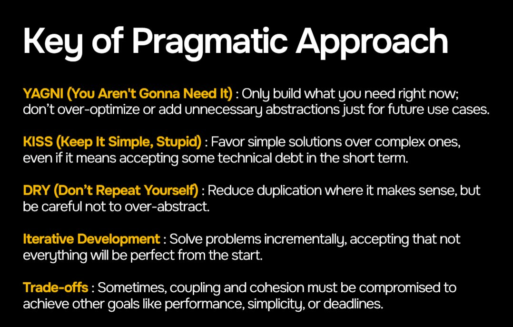
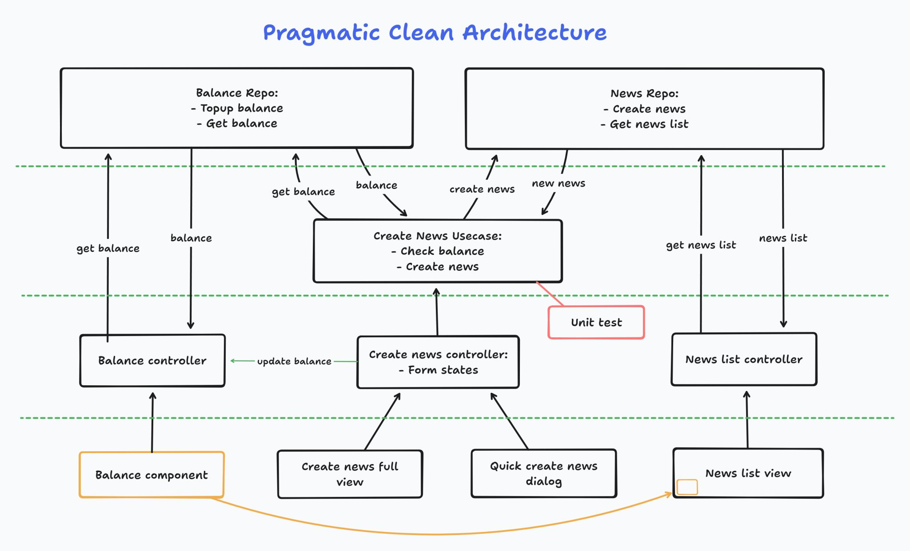

# awesome_flutter_template

Get your MVP product 50% done in day 1.
A flutter template to quickstart your flutter projects. Use this if you like pragmatic or less rigid approach.

## Flutter Version

Flutter 3.27.4 • channel stable • https://github.com/flutter/flutter.git
Framework • revision d8a9f9a52e (3 weeks ago) • 2025-01-31 16:07:18 -0500
Engine • revision 82bd5b7209
Tools • Dart 3.6.2 • DevTools 2.40.3

## Getting started

```
dart run husky install
git add .husky/pre-commit
git add .husky/pre-push
```

## TODO

Todo after creating new github repository from this template:

- [ ] Change application id. Shortcut: find all `com.example.flutter_usecase_template`
- [ ] Change project title in [main.dart](/lib/main.dart)
- [ ] Change your project base url in [constants](/lib/configs/constants.dart)
- [ ] If you have more stuff to differentiate between staging & prod build, add variable in [BuildFlavor](/lib/configs/flavors.dart)

## Project Architecture




### Repo

Repo class contains numbers of API call or local db functions.
Good for containing 1 API endpoints. E.g: /api/v1/profile.
So API operations upon profile endpoint is consolidated in profile_repo.dart

Example: [ProfileRepo](/lib/apps/profile/repo/profile_repo.dart)
After adding a repo, register it into [init_di](/lib/init_di.dart)

### Usecase

Usecase class contains a sequence or flow.
Really useful if the development is centered around backend, so that frontend has to handle its flow.
E.g: **Create new post**

1. Check owned credits from API get credits because posting requires some credits
2. Post data to API post to acquire post id
3. Post images to API images to submit the post image.
4. The whole flow can be called everywhere and will require some custom flow before / after post.

Without standardizing the flow in usecase, it will be risky for copy pasting the code everywhere.
Also it won't be clean if the views call a single AddPostController. There is a risk that your teammates start bulking AddPostController.
If a usecase only call a single API, you can directly return a repo, or you won't need a repo. Your call to standardize.

Example: [LoginUsecase](/lib/apps/auth/usecases/login_usecase.dart)
After adding a usecase, register it into [init_di](/lib/init_di.dart)

### Controller

Controller class handles the UI state and channel to usecase(s) if any.

Example: [LoginController](/lib/apps/auth/controllers/login_controller.dart)

### Page

Page class shows the page UI.

Example: [LoginPage](/lib/apps/auth/views/login/login_page.dart)

### File structure

Example if you want to CRUD an instance called Post:

- apps
  - post
    - repo
      - post_repo.dart
    - usecases
      - get_posts_usecase.dart
      - add_post_usecase.dart
      - delete_post_usecase.dart
      - update_post_usecase.dart
    - controllers
      - post_list_controller.dart
      - post_detail_controller.dart
      - add_post_controller.dart
    - views
      - list
        - post_list_page.dart
        - post_list_item.dart
      - detail
        - post_detail_page.dart
        - post_elements.dart
      - add
        - add_post_page.dart
        - some_elements.dart (for example)

## Unit Test

If your project is simply just 1 single API call to the backend without any complexity that needs to be secured, adding unit test for such flow is a waste.

### When to add Unit Test?

I normally add unit test for model & usecase only. The rest is unnecessary. But if you find anything that needs to be secured, add unit test for it.

#### Model

When your model contains some function modifier in addition for the result from json to dart and you need to secure it.

#### Usecase

When the usecase contains complex flow that produces different results based on the case happen and you need to secure it.
